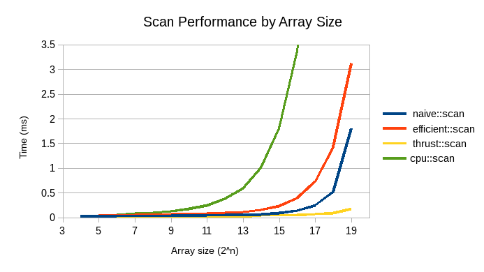
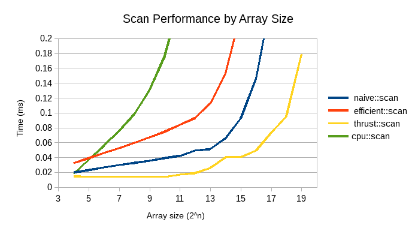
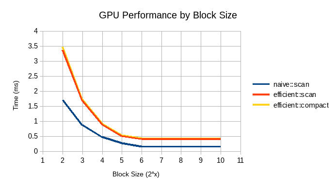
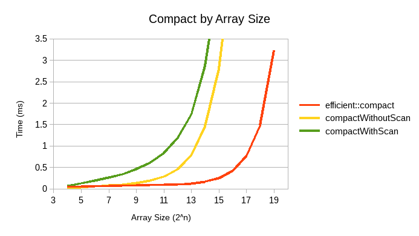

# CUDA Stream Compaction

**University of Pennsylvania, CIS 565: GPU Programming and Architecture, Project 2**

Terry Sun; Arch Linux, Intel i5-4670, GTX 750

## Library

This project contains a `stream_compaction` library and some associated tests.

`CPU`: A CPU implementation of `scan` and `scatter`, for reference and
performance comparisons. Runs in O(n) / O(n) adds.

`Naive`: A naive (non-work-efficient) implementation of `scan`, performing O(n)
adds and logn iterations.

`Efficient`: A work-efficient implementation of `scan` and `compact`. Also
contins `dv_scan`, the actual in-place scan implementation which takes a device
memory pointer directly (useful for other CUDA functions which need scan,
bypassing the need to generate the host-memory-pointers that `Efficient::scan`
would take). Performs O(nlogn) adds and runs 2logn iterations.

`Common`:
* `kernMapToBooleans`, used as the `filter`ing function in `Efficient::compact`.
* `kernScatter`, used in `Efficient::compact` and `Radix::sort`.

`Radix`: `sort` is so close to working but... doesn't work :(

## Performance Analysis

I did performance analysis with `CudaEvent`s for the GPU algorithm
implementations and `std::chrono` for the CPU implementations. As before, code
for this can be found on the `performance` (to avoid cluttering the main
codebase). Raw data (csv format) can be found in `data/`.

### Some fun charts

Measuring the performance of scan with a block size of 128 (where applicable).



I cut the top of the CPU line off and my chart is still horribly skewed. Let's
try again:



Interestingly, the sharp(ish) increase in `thrust::scan` around N=14 is
consistent between runs. Maybe it has to do with an increase in memory
allocation around that size.

`Naive` performs about twice as well as `Efficient`, which makes sense as the
work-efficient scan takes twice as many iterations of kernel calls. I suspect a
smarter method of spawning threads (only creating as many as you need instead of
creating 2^N every time and only using a subset) would improve performance on
the efficient algorithm, as it would result in more threads having the exact
same sequence of instructions to be executed. I think the performance gain on
efficient might be greater than `Naive` in this case because the `Efficient`
algorithm uses more iterations but fewer threads in each case, which would
explain why having a work-efficient algorithm is preferable. (I was planning
on testing this but -- as you can see -- I ran out of time.)

There's a small amount of moving memory from the device to host in
`Efficient::scan` - I don't if that has an appreciable impact, since it only
needs to copy `sizeof(int)`. `Efficient::compact` has even more memory copying
to retrieve the size of the compacted stream.



Tested on an array size of 2^16. `Naive::scan` and `Efficient::scan` are both
roughly optimal at a block size of 128.

The performance of `Efficient::compact` is dominated by `Efficient::scan`. The
only other computation happening in `compact` is `kernMapToBoolean` and
`kernScatter`, both of which are constant (in fact, 1 operation per thread), and
memory copying (see above).

Compact performance goes much the same way, to nobody's surprise:




## Test output

```
****************
** SCAN TESTS **
****************
    [  33  36  27  15  43  35  36  42  49  21  12  27  40 ...  28   0 ]
==== cpu scan, power-of-two ====
    [   0  33  69  96 111 154 189 225 267 316 337 349 376 ... 6371 6399 ]
==== cpu scan, non-power-of-two ====
    [   0  33  69  96 111 154 189 225 267 316 337 349 376 ... 6329 6330 ]
    passed 
==== naive scan, power-of-two ====
    [   0  33  69  96 111 154 189 225 267 316 337 349 376 ... 6371 6399 ]
    passed 
==== naive scan, non-power-of-two ====
    passed 
==== work-efficient scan, power-of-two ====
    [   0  33  69  96 111 154 189 225 267 316 337 349 376 ... 6371 6399 ]
    passed 
==== work-efficient scan, non-power-of-two ====
    [   0  33  69  96 111 154 189 225 267 316 337 349 376 ... 6329 6330 ]
    passed 
==== thrust scan, power-of-two ====
    passed 
==== thrust scan, non-power-of-two ====
    passed 

*****************************
** STREAM COMPACTION TESTS **
*****************************
    [   1   0   1   1   1   1   0   0   1   1   0   1   0 ...   0   0 ]
==== work-efficient compact, power-of-two ====
    passed 
==== work-efficient compact, non-power-of-two ====
    passed 
```
